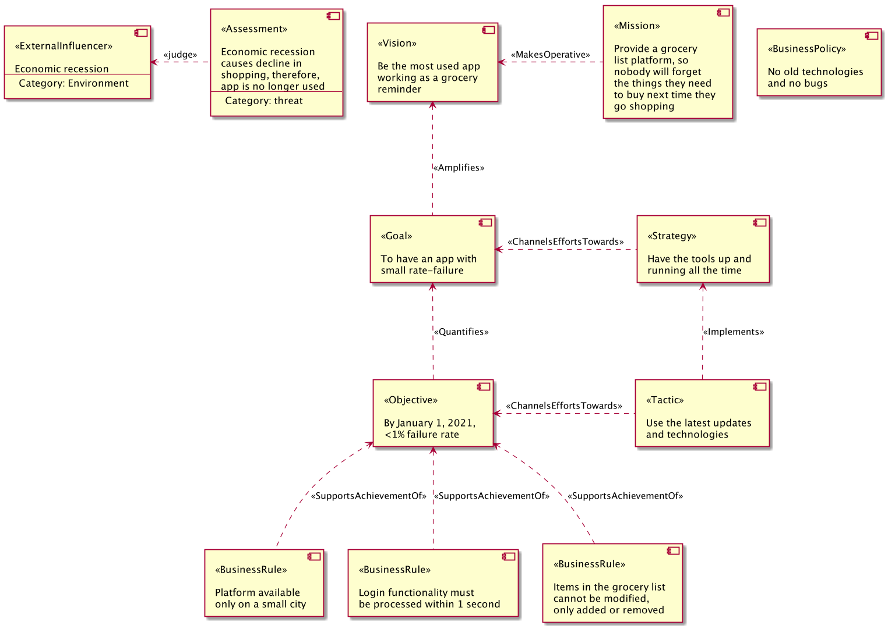

# Application using Spring Boot, React, OAuth2, MySQL 


# SpringSocial WebApp
- web application
- provides CRUD operations on groceries & countries
    - add grocery/country
    - delete grocery/country
- provides: basic login/register, login through facebook, view profile and logout

## Detail Description of the app
The application is a platform that has the client-server architecture offering CRUD 
functionalities to the client through API (Application Programming Interface) requests. It is a 
web application built in React which consumes REST services exposed by the application server. 
It provides the possibility to login with credentials or through using an access token for facebook.

### Technologies:
- frontend: ReactJS
- backend: Java
- database: Mysql

## run docker-compose 
```
in root: docker-compose up
```

## Access the application within the browser
```
(run docker-compose up before)
open browser (any) and access: localhost:3000
```

## Configure mysql db with bind address and date time zone
```
On MacOS: sudo nano /etc/my.cnf 
add:
-bind-address:0.0.0.0
-date-time-zone: +03.00
```

## Configure the application.yml depending on ways of running
```
Open spring-social/src/resources/application.yml

Uncomment 

spring:
    datasource:
        #url

depending on your preferences of running the applications
```

## Use case UML diagram
## 1


## 2


## C4Model

## System Context diagram
## 1 (Usual)


## 2 (Mermaid)

```mermaid
    graph TB
        User(["SpringSocial User [Person] - an user of the SpringSocial App"])
        GroceriesSystem("Groceries System [Software System] - provides CRUD operations on groceries")
        CountriesSystem[("Countries System [Software System] - provides CRUD operations on countries")]

        User-->|"makes CRUD operations using"|GroceriesSystem
        User-->|"makes CRUD operations using"|CountriesSystem

        GroceriesSystem-.->|"reads from and writes to"|GroceriesSystem
        CountriesSystem-.->|"reads from and writes to"|CountriesSystem

        classDef user fill:#008a09,stroke:#fff;
        classDef mainSystem fill:#003366,stroke:#fff;
        classDef externalSystem fill:grey,stroke:#fff;
        class User user;
        class GroceriesSystem mainSystem;
        class GroceriesSystem externalSystem;
        class CountriesSystem mainSystem;
        class CountriesSystem externalSystem;
```


## Container diagram


## BMM diagram


## SoaML diagram
