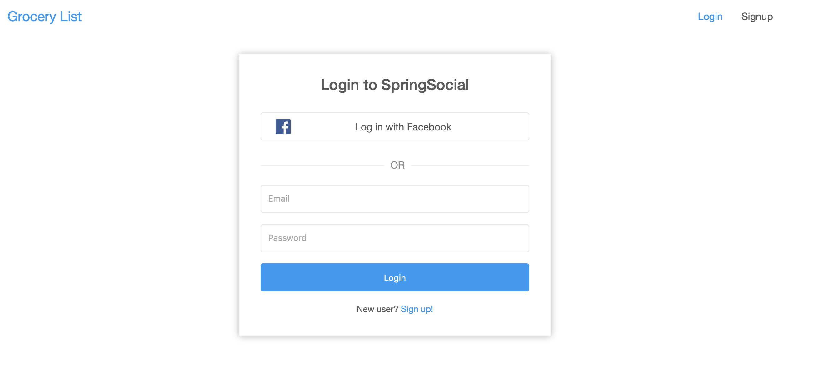
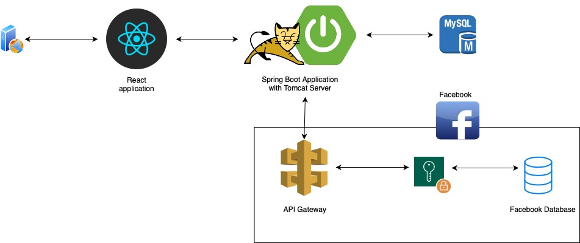
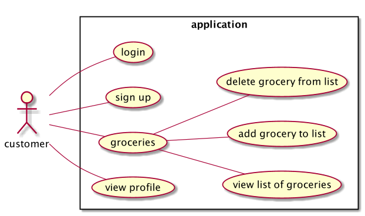
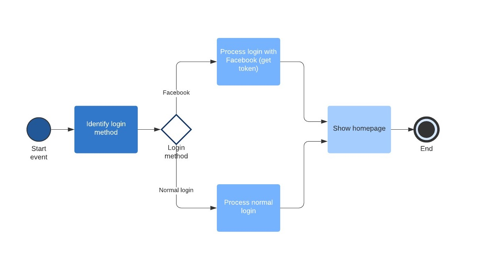

# Application using Spring Boot, React, OAuth2, MySQL 



## run docker-compose 
```
in root: docker-compose up
```

## Access the application within the browser
```
(run docker-compose up before)
open browser (any) and access: localhost:3000
```

## UML diagram


## Use case UML diagram


## BPMN diagram


## BMM diagram


## SoaML diagram
